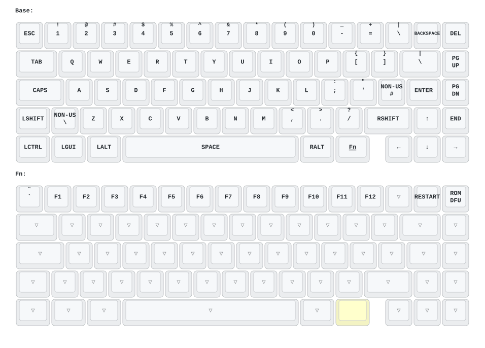

# Neo65 CU Wired ZMK Firmware

[한국어](README_ko.md)

Community ZMK firmware for the STM32F072-based **Qwertykeys/NEO Studio Neo65 CU wired PCB**. It provides a USB-only ZMK port, a hardware-validated firmware image, and a guarded Windows flasher that preserves the factory STM32 system-ROM bootloader.

> [!WARNING]
> This firmware is only for the **Neo65 CU wired PCB with an STM32F072CBT6**. Do not use it on the tri-mode PCB, the original Neo65, Neo65 Core Plus, Neo65 Sonic HE+, LINK65, or any other keyboard. Verify the PCB and MCU marking before flashing.

## Features

- USB HID keyboard support on the STM32F072CBT6
- QMK `LAYOUT_wired`-compatible 70-position matrix transform
- Two layers: Base and Fn
- Active-high Caps Lock indicator on PC13
- Three tested ways to enter the immutable STM32 ROM DFU bootloader
- Windows flasher with firmware, target, backup, and readback verification
- Pinned ZMK revision and fail-closed firmware audit in GitHub Actions
- Automatic keymap diagrams generated by [keymap-drawer](https://github.com/caksoylar/keymap-drawer)

## Supported hardware

| Item | Supported target |
| --- | --- |
| Keyboard | Qwertykeys/NEO Studio Neo65 CU |
| PCB | Wired PCB only |
| MCU | STM32F072CBT6 |
| Connection | USB only |
| Flash/SRAM | 128 KiB / 16 KiB |

VIA, Vial, ZMK Studio, Bluetooth, and 2.4 GHz wireless are not supported by this port.

## Verified firmware

The following raw BIN was built, statically audited, flashed to a real Neo65 CU, read back byte-for-byte, and tested on 2026-08-11. USB enumeration, every installed switch, the Fn layer, Windows key, Caps Lock LED, application reset, cold boot, and all three ROM DFU entry paths passed.

| Item | Value |
| --- | --- |
| Source commit | `2a36f566802fbc65287ddc931ae285326bfa16f5` |
| Actions run | [#31321651375](https://github.com/thsrhwk01/zmk-neo_neo65cu/actions/runs/31321651375) |
| File | `neo65cu-zmk.bin` |
| Size | 38,812 bytes (`0x979C`) |
| SHA-256 | `63669C31092A134764A3B9BB48FF251312EAFF1B73EDF787DABD2427C6BBF74A` |
| Initial MSP | `0x20001E18` |
| Reset handler | `0x080024B5` |

Compare the hash of the extracted **raw BIN**, not the ZIP or GitHub artifact digest. Do not substitute a BIN with a different SHA-256 unless it has gone through the same hardware validation process.

## Quick install on Windows

1. Download `NEO65CU-ZMK-Windows.zip` from the [latest Release](https://github.com/thsrhwk01/zmk-neo_neo65cu/releases/latest) and extract every file. Do not run the flasher from inside the ZIP.
2. Double-click `flash-neo65cu.cmd`.
3. Confirm that the target is a Neo65 CU wired PCB with an `STM32F072CBT6`. The confirmation defaults to **No** and performs no device access when cancelled.
4. When prompted, disconnect USB, hold `Esc`, reconnect USB, and then release `Esc`.
5. Wait for `Flash and byte-for-byte readback verification complete`.
6. Disconnect and reconnect USB without holding `Esc`.

The flasher refuses to write unless all of these checks pass:

- The BIN matches the hardware-validated SHA-256 and has valid STM32 vectors.
- Exactly one `0483:df11` DFU device exposes the expected STM32F072 memory map.
- A full 128 KiB main-flash backup succeeds before writing.
- Only alternate setting 0 at `0x08000000` is selected.
- The post-flash readback matches the BIN byte-for-byte.

Backups and checksums are written below the extracted package's `backups` directory. Copy them to a separate storage location immediately. The package includes a Korean driver and recovery guide in `README_KO.txt`.

If no Release exists yet, download `NEO65CU-ZMK-Windows` from the latest successful [Build and Release workflow](https://github.com/thsrhwk01/zmk-neo_neo65cu/actions/workflows/build.yml).

## Manual installation

The packaged Windows flasher is recommended. For a manual installation, first verify the exact raw BIN:

```powershell
Get-FileHash .\neo65cu-zmk.bin -Algorithm SHA256
```

Enter DFU by holding `Esc` while connecting USB, then run a fresh listing:

```powershell
dfu-util -l
```

Continue only if the device is `0483:df11` and exposes both of these memory maps:

- alt 0: internal flash at `0x08000000`, `64 × 2 KiB`
- alt 1: option bytes at `0x1FFFF800`, `16 bytes`

Use the path and serial from that same listing; never copy them from another computer or an older session. Back up all main flash before writing:

```powershell
$dfuPath = "path shown by the fresh dfu-util -l"
$dfuSerial = "serial shown by the fresh dfu-util -l"

dfu-util -d ",0483:df11" -p $dfuPath -S $dfuSerial `
  -a 0 -s "0x08000000:0x20000" `
  -U ".\neo65cu-mainflash-backup.bin"

(Get-Item .\neo65cu-mainflash-backup.bin).Length
```

The backup length must be `131072`. Then write only the validated image to alt 0 and read it back before rebooting:

```powershell
dfu-util -d ",0483:df11" -p $dfuPath -S $dfuSerial `
  -a 0 -s "0x08000000" `
  -D ".\neo65cu-zmk.bin"

dfu-util -d ",0483:df11" -p $dfuPath -S $dfuSerial `
  -a 0 -s "0x08000000:0x979C" `
  -U ".\neo65cu-zmk-readback.bin"

(Get-FileHash .\neo65cu-zmk.bin).Hash -eq `
  (Get-FileHash .\neo65cu-zmk-readback.bin).Hash
```

The comparison must return `True`. Disconnect and reconnect USB to boot the application.

Never use `-a 1`, option-byte writes, mass erase, `:leave`, LINK65's `0x08006000` application address, or LINK65's `1688:2220` USB ID.

## Keymap

The source keymap is [`boards/arm/neo65cu/neo65cu.keymap`](boards/arm/neo65cu/neo65cu.keymap). The Fn key is immediately to the left of the arrow cluster; while held, the number row becomes Grave and F1–F12.

| Keys | Action |
| --- | --- |
| `Backspace + Left Ctrl + Left Alt` | Restart the ZMK application |
| Hold `Esc` while connecting USB | Enter STM32 system-ROM DFU before ZMK starts |
| `Esc + Delete + Left Ctrl + Right Arrow` | Enter STM32 system-ROM DFU from ZMK |



The diagram intentionally shows all 70 logical `LAYOUT_wired` positions, including mutually exclusive ISO/split optional footprints that may not be populated on a particular build.

### Automatic keymap drawing

Pushing a change to the keymap, [`config/neo65cu.json`](config/neo65cu.json), or [`keymap_drawer.config.yaml`](keymap_drawer.config.yaml) runs [`draw-keymap.yml`](.github/workflows/draw-keymap.yml). The workflow parses the ZMK keymap and commits updated `keymap-drawer/neo65cu.yaml` and `keymap-drawer/neo65cu.svg` files to the same branch.

The reusable workflow is pinned to an exact keymap-drawer commit and installs keymap-drawer `0.23.0`. If automatic commits are rejected on a fork, enable **Settings → Actions → General → Workflow permissions → Read and write permissions**, subject to that branch's protection rules.

## Bootloader preservation and recovery

The factory USB DFU bootloader is in immutable STM32 system ROM at `0x1FFFC800`. Both the stock application and this ZMK image start in main flash at `0x08000000`; the ZMK linker and flasher never target system ROM.

The real device exposes:

- alt 0: `@Internal Flash /0x08000000/064*0002Kg`
- alt 1: `@Option Bytes /0x1FFFF800/01*016 e`

The Windows flasher checks both descriptors to identify the MCU but selects **alt 0 only**. It never selects alt 1, changes option bytes, performs a mass erase, or writes outside main flash.

Tested ROM DFU entry paths are:

1. Hold `Esc` while connecting USB.
2. From ZMK, press `Esc + Delete + Left Ctrl + Right Arrow`.
3. With the PCB exposed, hold the two pads of the rear unpopulated `SW?` footprint shorted while applying USB power.

The `SW?` pads did nothing when shorted while the keyboard was already running; the short must be present at power-on. Because the magnetic pogo-pin/daughterboard assembly makes the pads inaccessible in normal use, `Esc` is the preferred recovery method. Avoid probing other pads or holding a powered short after DFU enumeration.

## Build and release

The main workflow is pinned to ZMK `v0.3.0` commit `edf5c0814fd3ea202e43aad2d68fd32e882a518c`. It builds both the normal ZMK artifact and an independent auditable ELF/BIN, validates the memory map, vector table, clock/USB configuration, matrix, reset paths, and absence of persistent flash writers, then requires both BINs to be identical.

Every successful build can produce:

| Artifact | Contents |
| --- | --- |
| `firmware` | Raw `neo65cu-zmk.bin` from the standard ZMK workflow |
| `audit-neo65cu` | Independent ELF, BIN, map, and audit metadata |
| `NEO65CU-ZMK-Windows` | Guarded Windows flasher package |

The Windows package is fail-closed against [`release/neo65cu-zmk.sha256`](release/neo65cu-zmk.sha256). Any source or keymap change that produces a different BIN intentionally blocks packaging and release until that new image is audited, hardware-tested, read back, and explicitly approved by updating the manifest.

To publish a validated release, push an annotated version tag:

```console
git tag -a v1.0.0 -m "Release v1.0.0"
git push origin v1.0.0
```

Version tags publish `NEO65CU-ZMK-Windows.zip`, `neo65cu-zmk.bin`, and `SHA256SUMS.txt`. Tags containing letters, such as `v1.1.0-beta.1`, are marked as prereleases.

A prepared west workspace can also build the board locally:

```console
west build -s zmk/app -b neo65cu -- \
  -DZMK_CONFIG=/path/to/zmk-neo_neo65cu/config \
  -DZMK_EXTRA_MODULES=/path/to/zmk-neo_neo65cu
```

## Known limitations

- All installed switches and the Fn layer were tested; unpopulated ISO/split optional footprints could not be physically tested.
- USB cold boot was verified 3/3 times on the tested unit.
- There is no settings partition and no persistent configuration storage.
- VIA, Vial, and ZMK Studio are not available.
- This port supports only the wired PCB.

The step-by-step [English porting guide](docs/porting-guide.md) and
[Korean porting guide](docs/porting-guide_ko.md) explain the complete bring-up,
ROM handoff, audit, and hardware-validation process. The chronological evidence
log is in [`dev/porting-notes.md`](dev/porting-notes.md). Recovery binaries and
readbacks are intentionally excluded from Git; their exact external-backup
filenames and hashes are recorded in
[`dev/recovery-files.sha256`](dev/recovery-files.sha256).

## License

This repository is released under the [MIT License](LICENSE). ZMK, keymap-drawer, dfu-util, and other bundled third-party components remain under their respective licenses.
